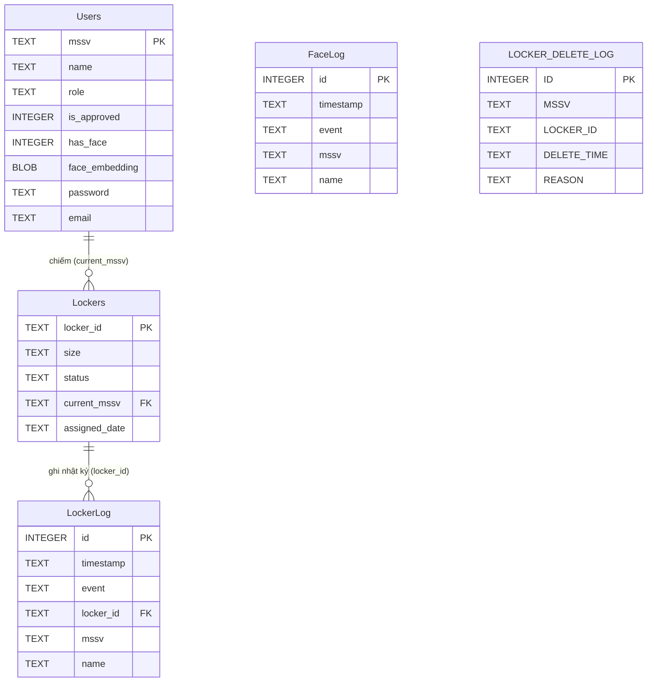

# 📋 Claude.md — Intelligent Locker Face Recognition
> Tổng hợp toàn bộ công việc  
> Dự án: https://github.com/nguyenduytruong1406-pixel/IntelligentLocker

---

## 🗂 Cấu trúc file hiện tại (FINAL — cập nhật 27/05/2026)

```text
test_db_ver1/
├── core/                         ← Database layer (phân tách từ locker_db.py gốc thành các module nhỏ)
│   ├── __init__.py
│   ├── db.py                     ← _conn(), migrate(), constants — tạo LOCKER_DELETE_LOG, fix status casing
│   ├── user_db.py                ← register_user, get_user, load/save_embedding
│   ├── locker_db.py              ← open_locker, assign_locker, release_locker, get_all_lockers,
│   │                                log_locker_delete, get_inactive_lockers, auto_cleanup_inactive
│   ├── log_db.py                 ← log_access, export_csv, rate_limit
│   └── firebase.py               ← sync_all_to_firebase, push_log
│
├── hardware/                     ← Phần cứng
│   ├── __init__.py
│   └── camera.py                 ← CameraBackend (winsdk), parse_bgr/gray
│
├── ai/                           ← AI / Face recognition
│   ├── __init__.py
│   ├── models.py                 ← Load dlib singleton (shape_pred, face_encoder)
│   ├── face_utils.py             ← Detection MediaPipe (detect_faces_bgr, center_face) — chuyển từ root vào đây
│   └── ai_utils.py               ← liveness(), landmarks(), embedding(), hash_password()
│
├── gui/                          ← Giao diện kiosk
│   ├── __init__.py
│   ├── kiosk_app.py              ← Class KioskApp (UI + state machine)
│   └── theme.py                  ← C{}, fonts, SCREEN_W/H, VERIFY_FRAMES, ...
│
├── public/                       ← Web frontend (giữ nguyên)
│   ├── landing.html              ← Trang chủ điều hướng (entry point)
│   ├── login.html                ← Đăng nhập admin
│   ├── index.html                ← Admin dashboard (4 tab)
│   ├── register.html             ← Sinh viên đăng ký tài khoản
│   ├── user-dashboard.html       ← Sinh viên tra cứu tủ
│   ├── 404.html                  ← Trang lỗi Not Found
│   
│
├── kiosk_gui.py                  ← Entry point kiosk — gọi KioskApp + khởi động auto-cleanup daemon thread
├── main_gui.py                   ← ⚠️ GUI tkinter nhận diện khuôn mặt ban đầu (prototype cũ) — ĐÃ được thay thế hoàn toàn bởi gui/kiosk_app.py, giữ lại để tham chiếu, KHÔNG dùng trong production
├── sync_listener.py              ← Lắng nghe Firebase realtime (Websocket Push)
├── sync_tool.py                  ← Tool đồng bộ thủ công
├── IntelligentLocker.db          ← DB chính (Users, Lockers, Logs)
├── blaze_face_short_range.tflite ← MediaPipe model
├── private_key_lockers.json      ← Service Account Key (KHÔNG commit git)
├── firebase.json / .firebaserc   ← Cấu hình Firebase Hosting


### ✅ File gốc đã xóa (22/05/2026)
| File | Thay bởi |
|---|---|
| `locker_db.py` (root) | Phân tách thành `core/db.py`, `core/user_db.py`, `core/locker_db.py`, `core/log_db.py`, `core/firebase.py` |
| `face_utils.py` (root) | Chuyển vào `ai/face_utils.py` |

### ❌ Files đã dư thừa — có thể xóa
| File | Lý do |
|---|---|
| `secure_db.py` | Thay bởi `locker_db.py` |
| `verify.py` | Thay bởi `verify_with_liveness.py` |
| `face_db.enc` | Đã migrate sang `IntelligentLocker.db` |
| `db.key` | Key cho `face_db.enc` cũ |
| `audit.db` | Log cũ → đã có LockerLog + FaceLog trong DB chính |
| `face_db_pkl.bak` | Backup file gốc ban đầu |
| `collect_liveness.py` | Chỉ dùng khi training, không cần production |
Các file liveness_check.py, enroll.py, verify_with_liveness.py đã được gộp luồng trực tiếp vào hệ thống chính để tối ưu hiệu suất.
---

## 🏗 Kiến trúc hệ thống

### Pipeline xác thực (verify_with_liveness.py)
```
Thread 1 — Camera (asyncio + winsdk)
    ↓ Frame Queue (maxsize=1, luôn frame mới nhất)
Thread 2 — AI
    • IR liveness check (liveness_check.py)
    • MediaPipe face detect (face_utils.py)
    • dlib ResNet embedding
    ↓ Result Queue (maxsize=1)
Thread 3 — UI (main thread)
    • cv2.imshow luôn ~30 FPS
    • Draw overlay + consecutive counter
    • Rate limit check
    → PASS → open_locker() → ghi LockerLog + push Firebase
```

Firebase Sync Architecture (Tối ưu Chi phí & Tốc độ)
Local → Firebase: Trực tiếp qua locker_db.py khi có sự kiện ở tủ đồ (mở/gán/trả tủ).

Firebase → Local (Realtime): Sử dụng sync_listener.py (Websocket push). Firebase tự đẩy event về Local khi Web Admin duyệt user (~0ms delay). Tuyệt đối không dùng polling để tiết kiệm tài nguyên và chi phí đọc dữ liệu.

Firebase ↔ Local (Khởi động): Sử dụng sync_tool.py để kéo/đẩy đối chiếu dữ liệu toàn diện khi hệ thống vừa khởi động lại hoặc mất mạng lâu.

### Luồng điều hướng Web
```
Truy cập web (index.html)
    → chưa login  → landing.html (3 card)
    → đã login    → index.html (dashboard)

landing.html
    → Đăng ký     → register.html
    → Admin       → login.html → index.html
    → Tra cứu     → user-dashboard.html
    → Đã login    → hiện admin bar (Vào Dashboard / Đăng xuất)
```

### Tech Stack
| Tầng | Công nghệ | Lý do chọn |
|---|---|---|
| Face Detection | Google MediaPipe BlazeFace | 5-15ms/frame trên CPU, góc rộng |
| Face Embedding | dlib ResNet 128-D | Tương thích DB hiện có |
| IR Liveness | Rule-based (mean/std) | Không cần train, không cần GPU |
| Database | SQLite (IntelligentLocker.db) | Nhẹ, offline, đủ dùng |
| Cloud Sync | Firebase Realtime DB + Admin SDK | Realtime, không cần pyrebase |
| GUI | tkinter + PIL | Có sẵn, nhẹ, mượt |
| Camera | winsdk (Windows Media Capture) | Truy cập IR camera Intel RealSense |

---

## 📐 Schema IntelligentLocker.db (FINAL)

### ERD — Quan hệ giữa các bảng



> **Ghi chú quan hệ:**
> - `Lockers.current_mssv` → `Users.mssv` (FK — NULL khi tủ trống)
> - `LockerLog.locker_id` → `Lockers.locker_id` (FK)
> - `LOCKER_DELETE_LOG` và `FaceLog` không có FK cứng — ghi độc lập

---

### Chi tiết từng bảng

| Bảng | Rows hiện tại | Sync Firebase | Mô tả |
|---|---|---|---|
| `Users` | 8 | ✅ `/users` | Tài khoản sinh viên + admin |
| `Lockers` | 9 | ✅ `/lockers` | Trạng thái 9 tủ (L01–L09) |
| `LockerLog` | 74 | ✅ `/logs` | Mọi sự kiện mở/gán/trả tủ |
| `FaceLog` | 6 | ❌ local only | Đăng ký / xác thực / thất bại khuôn mặt |
| `LOCKER_DELETE_LOG` | 2 | ✅ `/locker_delete_logs` | Lịch sử thu hồi tủ |

```sql
-- ── Users ──────────────────────────────────────────────────────────────────
Users (
    mssv           TEXT PRIMARY KEY,
    name           TEXT NOT NULL,
    role           TEXT DEFAULT 'student',    -- 'student' | 'admin'
    is_approved    INTEGER DEFAULT 0,         -- 0 | 1
    has_face       INTEGER DEFAULT 0,         -- 0 | 1
    face_embedding BLOB,                      -- numpy array pickle'd (128-D float64)
    password       TEXT,                      -- bcrypt hash
    email          TEXT DEFAULT ''
)

-- ── Lockers ─────────────────────────────────────────────────────────────────
Lockers (
    locker_id     TEXT PRIMARY KEY,           -- 'L01'...'L09'
    size          TEXT NOT NULL,              -- 'small' | 'big'
    status        TEXT DEFAULT 'empty',       -- 'empty' | 'occupied' (luôn lowercase)
    current_mssv  TEXT REFERENCES Users(mssv),
    assigned_date TEXT DEFAULT ''             -- 'YYYY-MM-DD HH:MM:SS' | ''
)

-- ── LockerLog — sync Firebase /logs ─────────────────────────────────────────
LockerLog (
    id        INTEGER PRIMARY KEY AUTOINCREMENT,
    timestamp TEXT NOT NULL,
    event     TEXT NOT NULL,                  -- OPEN_LOCKER | ASSIGN_LOCKER | RELEASE_LOCKER
    locker_id TEXT REFERENCES Lockers(locker_id),
    mssv      TEXT,
    name      TEXT
)

-- ── FaceLog — local only ─────────────────────────────────────────────────────
FaceLog (
    id        INTEGER PRIMARY KEY AUTOINCREMENT,
    timestamp TEXT NOT NULL,
    event     TEXT NOT NULL,                  -- FACE_REGISTER | FACE_VERIFY | FACE_FAIL
    mssv      TEXT,
    name      TEXT
)

-- ── LOCKER_DELETE_LOG — local + sync Firebase /locker_delete_logs ────────────
LOCKER_DELETE_LOG (
    ID          INTEGER PRIMARY KEY AUTOINCREMENT,
    MSSV        TEXT NOT NULL,
    LOCKER_ID   TEXT NOT NULL,
    DELETE_TIME TEXT NOT NULL,                -- 'YYYY-MM-DD HH:MM:SS'
    REASON      TEXT NOT NULL                 -- 'student_release' | 'auto_inactive_7days'
                                              -- | 'admin_force' | 'admin_deactivate'
)
```

> ⚠️ `Users` thực tế có thêm cột `password` (bcrypt hash) và `email` — README cũ thiếu 2 cột này.

---

## 🔥 Firebase Structure

```
/users/{mssv}                    → name, is_approved, has_face, role, email, registered_at
/lockers/{L01}                   → status, current_mssv, size, last_open_time
/logs/{push_id}                  → time, event, locker_id, mssv, name
/locker_delete_logs/{push_id}    → mssv, locker_id, delete_time, reason
```

### Security Rules (FINAL)
```json
{
  "rules": {
    "users": {
      ".read": true,
      "$mssv": {
        ".write": "!data.exists() || auth != null"
      }
    },
    "lockers": {
      ".read": true,
      ".write": "auth != null"
    },
    "logs": {
      ".read": "auth != null",
      ".write": "auth != null"
    },
    "locker_delete_logs": {
      ".read": "auth != null",
      ".write": "auth != null"
    }
  }
}
```

**Giải thích:**
- `/users` — ai cũng đọc được (tra cứu, dashboard); chỉ tạo mới khi chưa login, sửa/xóa cần auth
- `/lockers` — ai cũng đọc được; chỉ admin ghi
- `/logs` — chỉ admin đọc/ghi
- `/locker_delete_logs` — chỉ admin đọc/ghi; Python push khi trả tủ (student_release / auto_inactive_7days / admin_force / admin_deactivate)

### Firebase Sync — 2 chiều
| Chiều | Trigger | Code |
|---|---|---|
| Local → Firebase | open/assign/release locker | `locker_db.py` (inline) |
| Firebase → Local | web admin duyệt user, trả tủ | `sync_listener.py` (daemon thread) |

`sync_listener.py` lắng nghe:
- `/users/{mssv}/is_approved` → `UPDATE Users SET is_approved`
- `/lockers/{lid}/status = 'empty'` → `UPDATE Lockers SET status='empty', current_mssv=NULL`

Khởi động từ `main_gui.py`:
```python
import sync_listener
sync_listener.start()   # trước mainloop()
```

---

## 🌐 Web Admin — Các trang

| Trang | Mô tả | Auth |
|---|---|---|
| `landing.html` | Entry point, điều hướng 3 portal | Không |
| `login.html` | Đăng nhập admin | Không |
| `index.html` | Dashboard: Users, Lockers, Logs, Export CSV | Bắt buộc |
| `register.html` | Sinh viên đăng ký tài khoản mới | Không |
| `user-dashboard.html` | Tra cứu tủ theo MSSV, xem tiến trình | Không |

### Tính năng Web Admin (index.html)
- 4 nav tabs: **Trang Chủ | Sinh Viên | Tủ Khóa | Nhật Ký | Lịch Sử Tủ**
  - **Trang Chủ (Home):** Dashboard với 4 stat cards (Sinh viên đã duyệt, Chờ duyệt, Tủ trống, Tủ đang dùng)
  - **Sinh Viên (Users):** Danh sách user + tìm kiếm + duyệt/khóa thẻ + chi tiết modal + gán tủ admin
  - **Tủ Khóa (Lockers):** Sơ đồ 6 cột + hiện trạng + idle-days warning tag
  - **Nhật Ký (Logs):** Toàn bộ sự kiện tủ (OPEN/ASSIGN/RELEASE) — 50 events mới nhất
  - **Lịch Sử Tủ (Locker Delete Log):** Ghi lại mọi lần xóa sinh viên khỏi tủ (student_release / auto_inactive_7days / admin_force)
- Export CSV users/logs/delete-log
- Dark mode toggle (Light / Dark / Device Default) — lưu localStorage
- Badge số trên icon Nhật Ký khi có log mới
- Browser notification khi sinh viên đăng ký khuôn mặt
- Material Symbols Rounded icons
- Idle days indicator: 
  - 5-6 ngày: 🟡 Sắp đến hạn (yellow tag)
  - ≥7 ngày: 🔴 Có thể thu hồi (red tag + warning modal)

### Chi tiết từng Tab (5 tabs trong index.html)

#### 0️⃣ Home Tab (tab-home)
- **Stats Grid** (4 cards động)
  - Sinh viên đã duyệt
  - Chờ duyệt (notification badge count)
  - Tủ trống
  - Tủ đang dùng

#### 1️⃣ Users Tab (tab-users)
- **Search Box** (tìm MSSV hoặc tên)
- **Users Table** (tất cả users)
  - Columns: MSSV | Tên | Email | Khuôn Mặt | Trạng Thái | Hành Động
  - Khuôn Mặt: 🟢 Đã có / 🔴 Chưa có
  - Trạng Thái: 🟢 Đã duyệt / 🔴 Chờ duyệt
  - Actions: Chi tiết | Duyệt/Khóa thẻ
- **User Detail Modal** (wide, 500px)
  - Grid: MSSV, Tên, Email, Ngày đăng ký, Khuôn Mặt, Trạng Thái
  - Tủ đang mượn, Vai trò
  - Buttons: Gán tủ, Trả tủ
- **Assign Locker Modal**
  - Dropdown tủ trống (lọc status='empty')
  - Confirm/Cancel

#### 2️⃣ Lockers Tab (tab-lockers)
- **Locker Grid** (6 cột, responsive)
  - Layout cứng định (L01–L09)
  - Small: 2 col, 110px
  - Large: 3 col, 160px
  - Control box: Main Controller (blue gradient)
  - Status: 🟢 Trống / 🔴 Đang sử dụng
  - Idle indicator:
    - 0–4 ngày: số ngày (xanh)
    - 5–6 ngày: 🟡 X ngày idle
    - ≥7 ngày: 🔴 X ngày idle
  - Click: detail modal
- **Locker Detail Modal**
  - Tủ, Trạng Thái, Người Dùng (MSSV), Gán từ, Lần Mở Cuối, Số Ngày Idle
  - Color + warning cho ≥7 ngày

#### 3️⃣ Logs Tab (tab-logs)
- **Export CSV button**
- **Logs Table** (50 events gần nhất)
  - Columns: Thời Gian | MSSV | Tên | Tủ | Sự Kiện
  - Event colors (EVENT_MAP):
    - 🔓 Mở tủ (OPEN_LOCKER) — #007bff
    - 🆕 Gán tủ mới (ASSIGN_LOCKER) — #6f42c1
    - 🔒 Trả tủ (RELEASE_LOCKER) — #dc3545
    - 👤 Đăng ký khuôn mặt (FACE_REGISTER) — #28a745
  - DESC by time

#### 4️⃣ Locker Delete Log Tab (tab-delete-log) — NEW ⭐
- **Export CSV button** → `locker_delete_log_YYYY-MM-DD.csv`
- **Search Box** (tìm MSSV / tủ)
- **Delete Log Table**
  - Columns: Thời Gian | MSSV | Tủ | Lý Do
  - Reason mapping:
    - ✅ Sinh viên tự trả (`student_release`)
    - 🕐 Hệ thống 7 ngày idle (`auto_inactive_7days`)
    - 🔒 Admin ép trả (`admin_force`)
    - 👤 Vô hiệu hóa tài khoản (`admin_deactivate`)
  - Source: Firebase `/locker_delete_logs` (realtime onValue)

### Lưu ý kỹ thuật Web
- **Chạy qua HTTP**, không mở file:// trực tiếp (Firebase Auth không hoạt động)
- Local dev: `py -m http.server 5500` → `http://localhost:5500`
- Hàm trong `<script type="module">` cần gán vào `window.xxx` để HTML inline event gọi được
- `logs` yêu cầu auth → `user-dashboard.html` bọc riêng try/catch, không block phần còn lại
# 1. Chạy Web Local
cd public
py -m http.server 5500

# 2. Đồng bộ dữ liệu toàn diện (Chỉ chạy 1 lần lúc bật máy)
py -3.11 sync_tool.py

# 3. Khởi chạy GUI tủ đồ (Tự động kích hoạt sync_listener.py chạy ngầm)
py -3.11 main_gui.py
---

## 🖥 GUI tkinter (main_gui.py) — 4 Tab

| Tab | Chức năng |
|---|---|
| 🔍 Xác thực | Camera live + IR thumbnail + verify |
| ⚙ Đăng ký | Form MSSV + camera + chụp shot + lưu embedding |
| 👥 Quản lý | Danh sách user + search + trả tủ |
| 📋 Log | LockerLog + FaceLog + filter + xuất CSV |

---

## 🐛 Lỗi đã fix

| Lỗi | Nguyên nhân | Fix |
|---|---|---|
| `dlib compute_face_descriptor` TypeError | dlib 20.x đổi API | Dùng `dlib.get_face_chip()` trước |
| `mp.solutions` AttributeError | MediaPipe >= 0.10 bỏ API cũ | Dùng `mediapipe.tasks.python.vision` |
| Camera timeout `wait_both` | asyncio.Event deadlock | Đổi sang polling |
| `no such column: rfid` | DB đã bỏ rfid | Bỏ khỏi query + unpack |
| Firebase 404 Not Found | Database ở region Asia | Đổi URL sang `asia-southeast1` |
| Locker tạo thành `LL01` | `locker_id` đã là `"L01"`, code thêm `"L"` prefix | Bỏ format string thừa |
| `tab-title` null | `<h2>` thiếu `id="tab-title"` | Thêm id vào HTML |
| `lookup is not defined` | Hàm trong module không expose ra global | Đổi thành named function + `window.lookup=lookup` |
| Firebase không đọc được `/users` | Rule `$mssv.read:true` chỉ cho đọc node lẻ | Chuyển `.read:true` lên cấp `/users` |
| Web không kết nối Firebase | Chạy qua `file://` protocol | Dùng local HTTP server |
| `ModuleNotFoundError: No module named face_utils` | `ai/ai_utils.py` import kiểu root sau khi refactor | Đổi thành `from ai.face_utils import center_face` |
| `db_verify_password is not defined` | Tên hàm cũ sau khi tách `core/user_db.py` | Đổi thành `get_user_by_password()` |
| `db_register_user is not defined` | Tên hàm cũ sau khi tách `core/user_db.py` | Đổi thành `register_user()` |
| `AttributeError: pose_predictor_68_point_model_location` | Tên hàm sai trong `face_recognition_models` | Đổi thành `pose_predictor_model_location()` |
| Lambda closure bug trong locker grid picker | `lambda: assign_locker(lid)` capture `lid` của vòng lặp cuối | Đổi thành `lambda l=lid: ...` |

---

## ⚙ Cài đặt thư viện

```bash
py -3.11 -m pip install opencv-python numpy dlib mediapipe Pillow firebase-admin scikit-image scikit-learn winsdk
```

> **dlib:** Cài binary wheel từ https://github.com/z-mahmud22/Dlib_Windows_Python3.x (Python 3.11 + Windows)


## 📌 Tham số quan trọng

| Tham số | File | Giá trị | Ý nghĩa |
|---|---|---|---|
| `THRESHOLD` | verify_with_liveness.py | `0.45` | Ngưỡng khoảng cách embedding |
| `VERIFY_FRAMES` | verify_with_liveness.py | `3` | Số frame liên tiếp cần PASS |
| `MAX_FAILS` | locker_db.py | `5` | Số lần fail trước khi khóa |
| `LOCKOUT_SECS` | locker_db.py | `60` | Thời gian khóa (giây) |
| `BRIGHT_THRESHOLD` | liveness_check.py | `220` | IR mean > → FAKE |
| `DARK_THRESHOLD` | liveness_check.py | `30` | IR mean < → FAKE |
| `TEXTURE_MIN` | liveness_check.py | `8.0` | IR std < → FAKE |
| `TARGET_ENROLL_SHOTS` | main_gui.py | `5` | Số ảnh chụp khi enroll |

---

## 🗺 Bước tiếp theo

### Ưu tiên 2 — Ngắn hạn
- [ ] **Multi-user enroll**: hướng dẫn 5 góc mặt khác nhau
- [ ] **Feedback âm thanh**: beep khi PASS/FAIL
- [ ] **Xóa node LL01–LL09** trên Firebase Console (bug cũ)
- [ ] **Deploy Firebase Hosting** thay local server

### Ưu tiên 3 — Dài hạn
- [ ] **ArcFace** thay dlib ResNet (cần re-enroll)
- [ ] **Đóng gói .exe** với PyInstaller
- [ ] **REST API** (FastAPI) để web admin trigger verify

---

*Được tổng hợp bởi Claude Sonnet 4.6 — Ngày làm việc: 19–27/05/2026*


---

## 🔄 Sync Tool (sync_tool.py) — Đồng bộ 2 chiều thủ công

### Mục đích
Bổ sung cho `sync_listener.py` (realtime khi GUI đang chạy) — dùng để đối chiếu và bổ sung dữ liệu cho nhau khi 2 bên đã có thay đổi độc lập trước đó.

### Cách dùng
```bash
py -3.11 sync_tool.py          # Full sync 2 chiều (khuyến nghị khi khởi động)
py -3.11 sync_tool.py --pull   # Chỉ Firebase → SQLite
py -3.11 sync_tool.py --push   # Chỉ SQLite → Firebase
```

### Quy tắc ưu tiên
| Trường | Quyền |
|---|---|
| `name`, `is_approved`, `role` | Firebase thắng |
| Xóa tài khoản | Firebase thắng (xóa SQLite + trả tủ liên quan) |
| `has_face`, `face_embedding` | Local thắng (biometric không bị ghi đè) |
| `Lockers` status/size | SQLite → push lên Firebase |

### So sánh với sync_listener.py
| | sync_listener.py | sync_tool.py |
|---|---|---|
| Kiểu | Realtime daemon thread | Chạy 1 lần theo lệnh |
| Khi nào | GUI đang mở | Trước/sau phiên làm việc |
| Chiều | Firebase → SQLite | 2 chiều |
| Dữ liệu quá khứ | Không bắt được | ✅ Đối chiếu toàn bộ |

### Tích hợp vào main_gui.py (tùy chọn)
```python
import subprocess
subprocess.Popen(["py", "-3.11", "sync_tool.py"],
                 creationflags=subprocess.CREATE_NO_WINDOW)
```

---

## 🔄 Changelog Refactor — 27/05/2026

### Mục tiêu
1. Thêm **tính năng Trả tủ** cho sinh viên — menu Gửi đồ / Trả tủ sau khi đăng nhập
2. Thêm **auto-cleanup tủ 7 ngày idle** — warning ở ngày 6, delete ở ngày 7
3. Thêm **LOCKER_DELETE_LOG** — ghi mọi lần xóa sinh viên khỏi tủ (local + web admin)
4. Sửa **kiosk_app.py** — indent bug + release_locker() logic
5. Sửa **kiosk_gui.py** — tích hợp auto-cleanup daemon thread

### Các bước đã thực hiện

#### Core Layer — locker_db.py
- **log_locker_delete(mssv, locker_id, reason)** → ghi LOCKER_DELETE_LOG
- **get_inactive_lockers(days)** → query JOIN tủ không OPEN_LOCKER ≥ N ngày
- **auto_cleanup_inactive(warn_callback, delete_days=7, warn_days=6)** → 2 bước:
  - Ngày 6: gọi warn_callback (popup warning trên UI)
  - Ngày 7: release_locker() + log LOCKER_DELETE_LOG (reason=auto_inactive_7days)
- **release_locker()** sửa → trả về `(bool, str)` + ghi LOCKER_DELETE_LOG (reason=student_release)
- **get_all_lockers()** sửa WHERE clause → dùng LOWER(status)='empty'

#### DB Layer — db.py
- Thêm **CREATE TABLE LOCKER_DELETE_LOG** trong migrate()
- Fix **status casing** → chuẩn hoá lowercase (idempotent)
- Fix **email trailing whitespace** (User 22146436 có `\r\n`)

#### GUI Layer — kiosk_app.py
1. **New State: S_LOCKER_MENU** → sau xác thực, kiểm tra có tủ hay chưa
2. **_after_login()** refactor:
   - Chưa có tủ → _show_locker_picker() (chọn tủ từ sơ đồ)
   - Đã có tủ → _show_locker_menu() (menu Gửi đồ / Trả tủ)
3. **_show_locker_menu()** — 2 nút to rõ ràng:
   - 📦 GỬI ĐỒ → _do_open_locker() → success screen
   - 🔓 TRẢ TỦ → _confirm_release() → xác nhận 2 bước → gọi release_locker()
4. Fix **indent bug** — toàn bộ state handlers giờ nằm trong class
5. Fix **release_locker return value** — parse `(ok, msg)` tuple

#### Entry Point — kiosk_gui.py
- **_warn_callback()** → buffer queue, KHÔNG gọi tkinter từ daemon thread
- **_drain_warn_queue()** → drain trên main thread qua `app.after()` (thread-safe)
- **_cleanup_loop()** → daemon thread, mỗi 1 giờ
- Threading setup:
  ```python
  threading.Thread(target=_cleanup_loop, daemon=True).start()
  app.after(5_000, _drain_warn_queue, app)
  ```

#### Web Admin — index.html
- **New Tab: Lịch Sử Tủ (tab-delete-log)**
  - Read from Firebase `/locker_delete_logs` (realtime)
  - Search + filter MSSV / locker_id
  - Export CSV
  - Reason mapping: student_release / auto_inactive_7days / admin_force / admin_deactivate
- **Idle days indicator** (locker grid):
  - 5–6 ngày: 🟡 yellow tag
  - ≥7 ngày: 🔴 red tag (can release)
  - Modal detail: "X ngày ⚠️ Có thể thu hồi" hoặc "X ngày ⚡ Sắp đến hạn"

### Bug fix during implementation
1. **release_locker() sai return type** — cũ không return, giờ `(bool, str)`
2. **LOWER(status) query** — tránh bug casing từ migration cũ
3. **Thread-safe tkinter warning** → buffer queue + after()
4. **Auto-cleanup timing** → query ≥ warn_days, sau đó check ≥ delete_days

### Flow mới hoàn chỉnh
```
Kiosk Đăng nhập
    ↓ xác thực face
    ├─ Chưa có tủ → chọn từ sơ đồ → open_locker() → success
    └─ Đã có tủ → menu [📦 Gửi đồ | 🔓 Trả tủ]
            ├─ Gửi đồ → open_locker() → success
            └─ Trả tủ → confirm dialog → release_locker() → LOCKER_DELETE_LOG → idle

Background (mỗi 1h)
    auto_cleanup_inactive()
        ├─ ≥6 ngày → warn_callback → popup (tkinter safe via queue)
        └─ ≥7 ngày → release_locker() → LOCKER_DELETE_LOG (auto_inactive_7days)

Web Admin Nhật Ký Tủ
    View all LOCKER_DELETE_LOG entries
    Lọc / xuất CSV
```