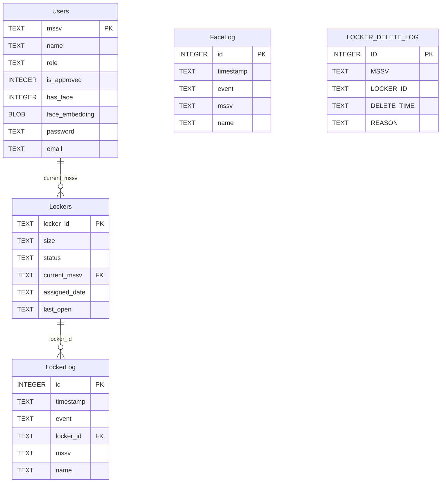

# 🔐 IntelligentLocker — Smart Locker với nhận diện khuôn mặt

> Hệ thống quản lý tủ đồ thông minh cho Makerspace HCMUTE  
> Kiosk nhận diện khuôn mặt · Web Admin · Đồng bộ Firebase realtime  
> 🔗 https://github.com/nguyenduytruong1406-pixel/IntelligentLocker

---

## 🚀 Quickstart

```bash
# 1. Cài thư viện Python
py -3.11 -m pip install opencv-python numpy dlib mediapipe Pillow \
    firebase-admin scikit-image scikit-learn winsdk python-dotenv

# 2. Tạo file môi trường
cp .env.example app_password.env
# → Điền MAIL_SENDER, MAIL_PASSWORD, MAIL_SENDER_NAME

# 3. Đồng bộ dữ liệu (chạy 1 lần khi mới boot hoặc sau khi mất mạng lâu)
py -3.11 sync_tool.py

# 4. Khởi động Kiosk (tự kéo sync_listener lên ngầm)
py -3.11 kiosk_gui.py

# 5. Chạy Web Admin local (tab riêng)
cd public
py -m http.server 5500
# → Mở http://localhost:5500
```

> **dlib trên Windows:** Cài binary wheel tại  
> https://github.com/z-mahmud22/Dlib_Windows_Python3.x (Python 3.11)

---

## 🗂 Cấu trúc dự án

```text
test_db_ver1/
├── core/                            ← Tầng Database
│   ├── db.py                        ← _conn(), migrate(), constants
│   ├── user_db.py                   ← register_user, get_user, load/save_embedding
│   ├── locker_db.py                 ← open_locker, assign_locker, release_locker,
│   │                                   auto_cleanup_inactive, log_locker_delete
│   └── log_db.py                    ← log_access, export_csv, rate_limit
│
├── hardware/
│   └── camera.py                    ← CameraBackend (winsdk), parse_bgr/gray
│
├── ai/
│   ├── models.py                    ← Load dlib singleton (shape_pred, face_encoder)
│   ├── face_utils.py                ← MediaPipe detect_faces_bgr, center_face
│   └── ai_utils.py                  ← liveness(), landmarks(), embedding(), hash_password()
│
├── gui/
│   ├── kiosk_app.py                 ← Class KioskApp — UI + state machine
│   └── theme.py                     ← Màu sắc, font, SCREEN_W/H, VERIFY_FRAMES
│
├── public/                          ← Web frontend
│   ├── landing.html                 ← Entry point (3 portal)
│   ├── login.html                   ← Đăng nhập admin
│   ├── index.html                   ← Admin dashboard (5 tab)
│   ├── register.html                ← Sinh viên đăng ký tài khoản
│   ├── user-dashboard.html          ← Sinh viên tra cứu tủ + yêu cầu trả tủ (OTP)
│   ├── emailjs_config.js            ← EmailJS credentials (KHÔNG commit git)
│   └── 404.html
│
├── kiosk_gui.py                     ← Entry point — chạy KioskApp + 3 daemon threads
├── sync_listener.py                 ← Firebase Websocket listener (realtime)
├── sync_tool.py                     ← Đồng bộ 2 chiều thủ công
├── IntelligentLocker.db             ← SQLite DB chính
├── blaze_face_short_range.tflite    ← MediaPipe model
├── app_password.env                 ← Gmail credentials (KHÔNG commit git)
├── private_key_lockers.json         ← Firebase Service Account (KHÔNG commit git)
└── firebase.json / .firebaserc      ← Firebase Hosting config
```

### ❌ Files dư thừa (có thể xóa)

| File | Lý do |
|---|---|
| `secure_db.py` | Thay bởi `core/locker_db.py` |
| `verify.py` | Gộp vào pipeline chính |
| `face_db.enc` + `db.key` | Đã migrate sang `IntelligentLocker.db` |
| `audit.db` | Thay bởi `LockerLog` + `FaceLog` trong DB chính |
| `face_db_pkl.bak` | Backup cũ |
| `collect_liveness.py` | Chỉ dùng khi training |
| `main_gui.py` | ⚠️ Prototype cũ — thay bởi `gui/kiosk_app.py` |

> `liveness_check.py`, `enroll.py`, `verify_with_liveness.py` đã được gộp trực tiếp vào pipeline chính.

---

## 🏗 Kiến trúc hệ thống

### Pipeline xác thực khuôn mặt

```
Thread 1 — Camera (asyncio + winsdk)
    ↓ Frame Queue (maxsize=1 — luôn lấy frame mới nhất)
Thread 2 — AI
    • IR liveness check  (rule-based mean/std)
    • MediaPipe BlazeFace detect
    • dlib ResNet 128-D embedding
    ↓ Result Queue (maxsize=1)
Thread 3 — UI (main thread tkinter)
    • Render ~30 FPS
    • Draw overlay + consecutive counter
    • Rate limit check (max 5 fails → lockout 60s)
    → PASS → open_locker() → SQLite + Firebase
```

### Kiosk State Machine

```
S_IDLE
  └─ nhập MSSV ──────────────────────────────────► S_FACE_MSSV
                                                        │
                                          camera bật, xác thực khuôn mặt
                                                        │
                                                   _after_login()
                                                   ┌────┴────┐
                                              có tủ          chưa có tủ
                                                │                │
                                        S_LOCKER_MENU     _show_locker_picker()
                                        ┌───────┴──────┐
                                   📦 Gửi đồ      🔓 Trả tủ
                                        │               │
                                  open_locker()   confirm 2 bước
                                                  → release_locker()
                                                  → LOCKER_DELETE_LOG
```

### Firebase Sync Architecture

```
Kiosk / SQLite ──────────────────────────────────► Firebase
   (locker_db.py inline khi open/assign/release)

Firebase ────────────────────────────────────────► SQLite
   (sync_listener.py — Websocket push, ~0ms delay)
   Lắng nghe: /users · /lockers · /otp_requests · /verify_attempts

Firebase ◄──────────────────────────────────────► SQLite
   (sync_tool.py — chạy 1 lần khi boot hoặc sau mất mạng)
```

> **Không dùng polling** — toàn bộ Firebase → Local dùng Websocket push để tiết kiệm chi phí đọc.

### Luồng OTP trả tủ (server-side verify)

```
Web client              Firebase              sync_listener.py
    │                      │                        │
    │── otp_requests/{m} ──►│                        │
    │                      │──── on_otp_request ───►│
    │                      │                        │ sinh OTP
    │                      │                        │ lưu SHA-256(OTP) → otp_tokens
    │                      │                        │ gửi OTP gốc qua email
    │                      │                        │
    │  [user nhập OTP]     │                        │
    │── verify_attempts ───►│                        │
    │                      │──── on_verify_attempt ►│
    │                      │                        │ so sánh hash
    │                      │                        │ rate limit (max 5 lần)
    │                      │◄── verify_results ─────│
    │◄── onValue ──────────│                        │
    │   {ok, reason}       │                        │
```

> Client **không bao giờ đọc** `otp_tokens` — chỉ server biết hash.

### Luồng điều hướng Web

```
landing.html
  ├─► register.html       (sinh viên đăng ký)
  ├─► login.html          (admin)
  │     └─► index.html    (dashboard 5 tab)
  └─► user-dashboard.html (tra cứu tủ, yêu cầu trả tủ)
```

### Daemon Threads trong kiosk_gui.py

```python
threading.Thread(target=_heartbeat_loop,       daemon=True).start()  # mỗi 30s
threading.Thread(target=_cleanup_loop,         daemon=True).start()  # mỗi 1h
threading.Thread(target=_pending_expire_loop,  daemon=True).start()  # mỗi 6h
app.after(5_000, _drain_warn_queue, app)                             # tkinter-safe
```

| Thread | Chu kỳ | Chức năng |
|---|---|---|
| `_heartbeat_loop` | 30s | Ghi `/kiosk_status/last_seen` lên Firebase |
| `_cleanup_loop` | 1h | Thu hồi tủ idle ≥7 ngày, cảnh báo ngày 6 |
| `_pending_expire_loop` | 6h | Xóa tài khoản chờ duyệt quá hạn, gửi mail |

---

## 🌐 Web Admin

### Các trang

| Trang | Mô tả | Auth |
|---|---|---|
| `landing.html` | Entry point — điều hướng 3 portal | Không |
| `login.html` | Đăng nhập admin | Không |
| `index.html` | Dashboard admin (5 tab) | Bắt buộc |
| `register.html` | Sinh viên tự đăng ký tài khoản | Không |
| `user-dashboard.html` | Tra cứu tủ, idle warning, yêu cầu trả tủ | Không |

### 5 Tab trong index.html

| Tab | Nội dung |
|---|---|
| 🏠 Trang Chủ | 5 stat cards: Đã duyệt · Chờ duyệt · Tủ trống · Tủ đang dùng · **Kiosk status** |
| 👥 Sinh Viên | Bảng users · tìm kiếm · duyệt/khóa · gán tủ · xóa thẻ thủ công |
| 🔒 Tủ Khóa | Grid L01–L09 · idle indicator 🟡🔴 · detail modal |
| 📋 Nhật Ký | 50 events gần nhất · Export CSV |
| 🗑 Lịch Sử Tủ | Toàn bộ LOCKER_DELETE_LOG · filter · Export CSV |

**Tính năng nổi bật:**
- Kiosk status badge realtime (Online 🟢 / Offline 🔴) — hiện trên mọi tab
- Toast + Browser notification khi có yêu cầu trả tủ mới
- Idle indicator: 🟡 5–6 ngày · 🔴 ≥7 ngày (có thể thu hồi)
- Auto-expire thẻ pending sau N ngày (cấu hình qua modal ⚙️)
- Dark mode · Export CSV · Material Symbols Rounded icons

### Lưu ý kỹ thuật

```bash
# Bắt buộc chạy qua HTTP — Firebase Auth không hoạt động với file://
py -m http.server 5500
```

- Hàm trong `<script type="module">` phải gán vào `window.xxx` để inline event gọi được
- `onValue` listeners bọc trong `startDataListeners()` — chỉ gọi sau `onAuthStateChanged`

---

## 📐 Database Schema

### ERD


```mermaid
erDiagram
    Users {
        TEXT mssv PK
        TEXT name
        TEXT role
        INTEGER is_approved
        INTEGER has_face
        BLOB face_embedding
        TEXT password
        TEXT email
    }
    Lockers {
        TEXT locker_id PK
        TEXT size
        TEXT status
        TEXT current_mssv FK
        TEXT assigned_date
        TEXT last_open
    }
    LockerLog {
        INTEGER id PK
        TEXT timestamp
        TEXT event
        TEXT locker_id FK
        TEXT mssv
        TEXT name
    }
    FaceLog {
        INTEGER id PK
        TEXT timestamp
        TEXT event
        TEXT mssv
        TEXT name
    }
    LOCKER_DELETE_LOG {
        INTEGER ID PK
        TEXT MSSV
        TEXT LOCKER_ID
        TEXT DELETE_TIME
        TEXT REASON
    }

    Users ||--o{ Lockers     : "current_mssv"
    Lockers ||--o{ LockerLog : "locker_id"
```

### Chi tiết bảng

| Bảng | Sync Firebase | Mô tả |
|---|---|---|
| `Users` | ✅ `/users` | Tài khoản sinh viên + admin |
| `Lockers` | ✅ `/lockers` | Trạng thái 9 tủ L01–L09 |
| `LockerLog` | ✅ `/logs` | Mọi sự kiện OPEN / ASSIGN / RELEASE |
| `FaceLog` | ❌ local only | FACE_REGISTER / FACE_VERIFY / FACE_FAIL |
| `LOCKER_DELETE_LOG` | ✅ `/locker_delete_logs` | Lịch sử thu hồi tủ |

```sql
Users (
    mssv           TEXT PRIMARY KEY,
    name           TEXT NOT NULL,
    role           TEXT DEFAULT 'student',    -- 'student' | 'admin'
    is_approved    INTEGER DEFAULT 0,         -- 0 | 1
    has_face       INTEGER DEFAULT 0,         -- 0 | 1
    face_embedding BLOB,                      -- numpy array pickle'd (128-D float64)
    password       TEXT,                      -- SHA-256 hash
    email          TEXT DEFAULT ''
)

Lockers (
    locker_id     TEXT PRIMARY KEY,           -- 'L01'...'L09'
    size          TEXT NOT NULL,              -- 'small' | 'big'
    status        TEXT DEFAULT 'empty',       -- 'empty' | 'occupied' (luôn lowercase)
    current_mssv  TEXT REFERENCES Users(mssv),
    assigned_date TEXT DEFAULT '',            -- 'YYYY-MM-DD HH:MM:SS' | ''
    last_open     TEXT DEFAULT ''             -- 'YYYY-MM-DD HH:MM:SS' | ''
)

LockerLog (
    id        INTEGER PRIMARY KEY AUTOINCREMENT,
    timestamp TEXT NOT NULL,
    event     TEXT NOT NULL,                  -- OPEN_LOCKER | ASSIGN_LOCKER | RELEASE_LOCKER
    locker_id TEXT REFERENCES Lockers(locker_id),
    mssv      TEXT,
    name      TEXT
)

LOCKER_DELETE_LOG (
    ID          INTEGER PRIMARY KEY AUTOINCREMENT,
    MSSV        TEXT NOT NULL,
    LOCKER_ID   TEXT NOT NULL,
    DELETE_TIME TEXT NOT NULL,
    REASON      TEXT NOT NULL                 -- student_release | auto_inactive_7days
)                                             -- | admin_force | admin_deactivate | admin_delete_card
```

---

## 🔥 Firebase Structure

```
/users/{mssv}                    → name, is_approved, has_face, role, email, registered_at
/lockers/{L01}                   → status, current_mssv, size, last_open, assigned_date
/logs/{push_id}                  → time, event, locker_id, mssv, name
/locker_delete_logs/{push_id}    → mssv, locker_id, delete_time, reason
/release_requests/{mssv}         → mssv, locker_id, requested_at, status
/kiosk_status/last_seen          → ISO timestamp (heartbeat mỗi 30s)
/kiosk_status/connected          → bool
/otp_requests/{mssv}             → email, name, requested (web → kiosk)
/otp_tokens/{mssv}               → hashed_code, expires_at, attempts (kiosk only)
/verify_attempts/{mssv}          → code, ts (web → kiosk)
/verify_results/{mssv}           → ok, reason, ts (kiosk → web)
```

### Security Rules (cập nhật 05/06/2026)

```json
{
  "rules": {
    "users": {
      ".read": "auth != null",
      ".write": "auth != null",
      "$mssv": {
        ".read": true,
        ".write": "auth != null || !data.exists()"
      }
    },
    "lockers":           { ".read": true, ".write": "auth != null" },
    "logs":              { ".read": "auth != null", ".write": "auth != null" },
    "locker_delete_logs":{ ".read": "auth != null", ".write": "auth != null" },
    "kiosk_status":      { ".read": true, ".write": "auth != null" },
    "release_requests": {
      ".read": "auth != null",
      "$mssv": { ".read": true, ".write": true }
    },
    "otp_requests": {
      "$mssv": { ".read": "auth != null", ".write": true }
    },
    "otp_tokens": {
      "$mssv": { ".read": "auth != null", ".write": "auth != null" }
    },
    "verify_attempts": {
      "$mssv": { ".read": "auth != null", ".write": true }
    },
    "verify_results": {
      "$mssv": { ".read": true, ".write": "auth != null" }
    }
  }
}
```

**Giải thích quan trọng:**
- `otp_tokens` — chỉ Admin SDK đọc/ghi; client không bao giờ thấy hash
- `verify_attempts` — client ghi code nhập vào; server verify
- `verify_results` — client đọc kết quả; chỉ server ghi
- `/users/$mssv` ghi: `!data.exists()` cho phép sinh viên tự đăng ký lần đầu

### Sync Rules ưu tiên

| Trường | Quy tắc |
|---|---|
| `name`, `is_approved`, `role` | Firebase thắng |
| `has_face`, `face_embedding` | Local thắng (biometric không bị ghi đè từ web) |
| `Lockers.last_open` | Lấy giá trị **mới hơn** (ISO string compare) |
| Xóa tài khoản | Firebase thắng → xóa SQLite + trả tủ liên quan |

---

## ⚙️ Cấu hình

### .env / app_password.env

| Biến | Bắt buộc | Mô tả |
|---|---|---|
| `MAIL_SENDER` | Không | Gmail dùng để gửi OTP và mail thông báo |
| `MAIL_PASSWORD` | Không | Gmail App Password (16 ký tự) — tạo tại myaccount.google.com/apppasswords |
| `MAIL_SENDER_NAME` | Không | Tên hiển thị trong email (mặc định: "Smart Locker — HCMUTE") |

> Nếu chưa cấu hình → tính năng mail tắt im lặng, hệ thống vẫn hoạt động bình thường.

### emailjs_config.js (public/)

```js
window.EMAILJS_CONFIG = {
  publicKey : "YOUR_PUBLIC_KEY",
  serviceId : "YOUR_SERVICE_ID",
  templateId: "YOUR_TEMPLATE_ID"
};
```

> Dùng làm fallback gửi OTP khi Kiosk offline (`last_seen > 90s`).

### .gitignore

```
app_password.env
private_key_lockers.json
emailjs_config.js
.warn_flags/
IntelligentLocker.db
```

---

## 📌 Tham số quan trọng

| Tham số | Module | Giá trị | Ý nghĩa |
|---|---|---|---|
| `THRESHOLD` | `ai/ai_utils.py` | `0.45` | Ngưỡng khoảng cách embedding khuôn mặt |
| `VERIFY_FRAMES` | `gui/theme.py` | `3` | Số frame liên tiếp cần PASS |
| `MAX_FAILS` | `core/locker_db.py` | `5` | Số lần fail trước khi lockout |
| `LOCKOUT_SECS` | `core/locker_db.py` | `60` | Thời gian lockout (giây) |
| `BRIGHT_THRESHOLD` | `ai/ai_utils.py` | `220` | IR mean > → FAKE (ảnh in) |
| `DARK_THRESHOLD` | `ai/ai_utils.py` | `30` | IR mean < → FAKE (che camera) |
| `TEXTURE_MIN` | `ai/ai_utils.py` | `8.0` | IR std < → FAKE |
| `KIOSK_ONLINE_SECS` | `user-dashboard.html` | `90` | last_seen < 90s → Kiosk ONLINE |
| `OTP_MAX_ATTEMPTS` | `sync_listener.py` | `5` | Số lần thử OTP sai tối đa |
| `PENDING_EXPIRE_DAYS` | `kiosk_gui.py` | `7` | Ngày tự xóa tài khoản chờ duyệt |
| `PENDING_WARN_DAYS` | `kiosk_gui.py` | `2` | Ngày gửi mail cảnh báo trước khi xóa |

---

## 🔄 Sync Tool (sync_tool.py)

```bash
py -3.11 sync_tool.py          # Full sync 2 chiều (khuyến nghị khi boot)
py -3.11 sync_tool.py --pull   # Chỉ Firebase → SQLite
py -3.11 sync_tool.py --push   # Chỉ SQLite → Firebase
```

| | `sync_listener.py` | `sync_tool.py` |
|---|---|---|
| Kiểu | Realtime daemon (Websocket) | Chạy 1 lần theo lệnh |
| Khi nào dùng | Luôn chạy cùng Kiosk | Lúc boot / sau mất mạng lâu |
| Chiều | Firebase → SQLite | 2 chiều |
| Bắt dữ liệu quá khứ | ❌ | ✅ |

---

## 🛠 Tech Stack

| Tầng | Công nghệ | Lý do chọn |
|---|---|---|
| Face Detection | Google MediaPipe BlazeFace | 5–15ms/frame trên CPU, góc rộng |
| Face Embedding | dlib ResNet 128-D | Tương thích DB hiện có |
| IR Liveness | Rule-based (mean/std) | Không cần train, không cần GPU |
| Database | SQLite | Nhẹ, hoạt động offline |
| Cloud Sync | Firebase Realtime DB + Admin SDK | Realtime push, không cần pyrebase |
| GUI Kiosk | tkinter + PIL | Có sẵn, nhẹ, thread-safe với after() |
| Camera | winsdk (Windows Media Capture) | Truy cập IR stream Intel RealSense |
| OTP Email | Gmail SMTP (primary) + EmailJS (fallback) | Không cần backend server |
| Hardware | Waveshare 7" 1024×600 cảm ứng | Màn hình kiosk nhúng |

---

## 🐛 Known Issues & Limitations

| Hạn chế | Chi tiết |
|---|---|
| Windows only | `winsdk` chỉ hỗ trợ Windows — không chạy được trên Linux/macOS |
| 9 tủ cố định | `L01–L09` hardcode trong DB seed; mở rộng cần sửa migration |
| 1 kiosk | Kiến trúc hiện tại giả định 1 kiosk duy nhất |
| Offline EmailJS | OTP mode offline sinh code phía client — kém bảo mật hơn online mode |


---

## 📅 Changelog tóm tắt

| Ngày | Nội dung |
|---|---|
| 19–27/05 | Khởi tạo dự án, refactor module hóa, face enroll/verify pipeline |
| 27/05 | Thêm Trả tủ (S_LOCKER_MENU), auto-cleanup 7 ngày, LOCKER_DELETE_LOG |
| 28/05 | Web: xóa thẻ thủ công, auto-expire pending, modal Cài Đặt tập trung |
| 29/05 | Pending expire daemon, gửi mail warning, sync `last_open` 2 chiều |
| 03/06 | 2FA OTP email khi đăng nhập kiosk, fix JS Date Trap, fix Firebase rules |
| 04/06 | Fix đồng bộ `assigned_date`/`last_open`, heartbeat kiosk, bàn phím ảo 1024×600 |
| 05/06 | Kiosk status realtime trên admin, OTP trả tủ server-side verify (SHA-256 hash) |

> Chi tiết từng thay đổi xem tại [`CHANGELOG.md`](./CHANGELOG.md)

---

*Smart Locker — HCMUTE Makerspace · Python 3.11 · Firebase Realtime DB*